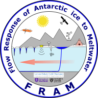

# Flow Response of Antarctic Ice to Meltwater (FRAM)

 

 For sharing code and data, and tracking progress on the NSF Antarctic Peninsula project: Flow Response of Antarctic Ice to Meltwater (FRAM)

 The project's official name is "NSFGEO-NERC: Investigating the Direct Influence of Meltwater on Antarctic Ice Sheet Dynamics

 It also hosts a simple website for sharing information publicly and across the project team [here](https://ldeo-glaciology.github.io/AntPen_NSF_NERC/).

