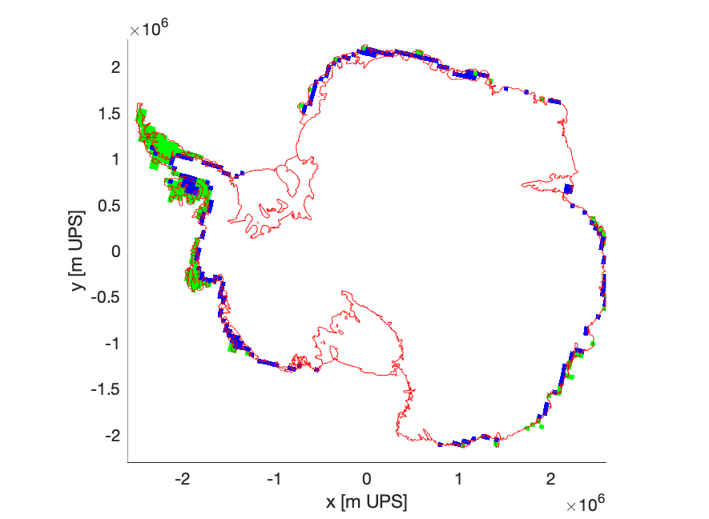

# Figure 2 from the proposal. 

This directory contains code and data to plot figure 2 from the proposal. 

The code is in matlab and it requires [topotoolbox](https://topotoolbox.wordpress.com/) and [Antarctic boundaries, grounding line, and masks from InSAR](https://www.mathworks.com/matlabcentral/fileexchange/60246-antarctic-boundaries-grounding-line-and-masks-from-insar).

I would like to re-write this in python some day. 

The two panels show:

The map (melt_change_map2.png):
Areas that experience melt rates that exceed those seen at Flask and Crane glaciers today (green) and at the end of the century under RCP8.5 (blue). The red star shows the location of Flask Glacier. The grounding line is in red (Depoorter et al., 2013). Data from Trusel et al. (2015). 

The histogram (frac_melt_plot_500.pdf): The percentage of grounded ice lower than 500 m a.s.l. that sees melt rates larger than various melt rates, m. 

References: 

Depoorter, M.A., Bamber, J.L., Griggs, J.A., Lenaerts, J.T., Ligtenberg, S.R., van den Broeke, M.R. and Moholdt, G., 2013. Calving fluxes and basal melt rates of Antarctic ice shelves. Nature, 502(7469), p.89.
Doyle, S.H., Hubbard, A., Fitzpatrick, A.A., Van As, D., Mikkelsen, A.B., Pettersson, R. and Hubbard, B., 2014. Persistent flow acceleration within the interior of the Greenland ice sheet. Geophysical Research Letters, 41(3), pp.899-905.

Trusel, L., Frey, K., Das, S. et al. Divergent trajectories of Antarctic surface melt under two twenty-first-century climate scenarios. Nature Geosci 8, 927–932 (2015). https://doi.org/10.1038/ngeo2563
