# NSFGEO-NERC: Investigating the Direct Influence of Meltwater on Antarctic Ice Sheet Dynamics

A simple site for hosting information about the project. The GitHub repository behind the site is [here](https://github.com/ldeo-glaciology/AntPen_NSF_NERC/blob/main/index.md). 

## About the project
This project is jointly funded by the UK Natural Environment Research Council (NERC) and the US National Science Foundation (NSF). NSF hosts a page about the project [here](https://www.nsf.gov/awardsearch/showAward?AWD_ID=2053169). It is inspired by a paper published by the UK members of the team, ([Tuckett et al., 2019](https://doi.org/10.1038/s41467-019-12039-2)).

The current project team (in alphabetical order):
- Isabel Cordero, Lamont-Doherty Earth Observatory (LDEO), Columbia University, USA
- Ben Davison, University of Sheffield, UK
- Jeremy Ely, University of Sheffield, UK
- Nick Frearson, (LDEO), Columbia University, USA
- Jonathan Kingslake, LDEO, Columbia University, USA
- Stephen Livingstone, University of Sheffield, UK
- Andrew Sole, University of Sheffield, UK
- Rohi Muthyala, LDEO, Columbia University, USA
- Kate Winter, Northumbria University, UK

The project will fund two field seasons on Flask Glacier on the Antarctic Peninsula, and continent wide remote sensing. 

The field plan includes:
- Global Navigation Satellite System (GNSS) measurements of ice flow
- Automatic weather station (AWS) measurements of surface melt
- Measurements of near surface temperatures with a thermistor string
- Uncrewed aerial system (UAS) measurements of ice flow
- Ice-penetrating radar measurements of ice flow (ApRES)
- Passive seismic detection of subglacial water flow

The preliminary field plan is shown below.

The field team for the first season is Rohi, Kate and Ben and they are scheduled to be in Antarctica between Nov 2024 and Jan 2025. 

## News 

### November 13th 2024 - file team makes it to Punta Arenas, Chile
The field team (Ben, Rohi, Kate) have made it to Punta Arenas in Chile, which is one of the main gateways to the Antarctic Peninsula. The journey from the UK to the British Antarctic Survey Rothera Research Station takes a couple of days, with 28 hours of flying time 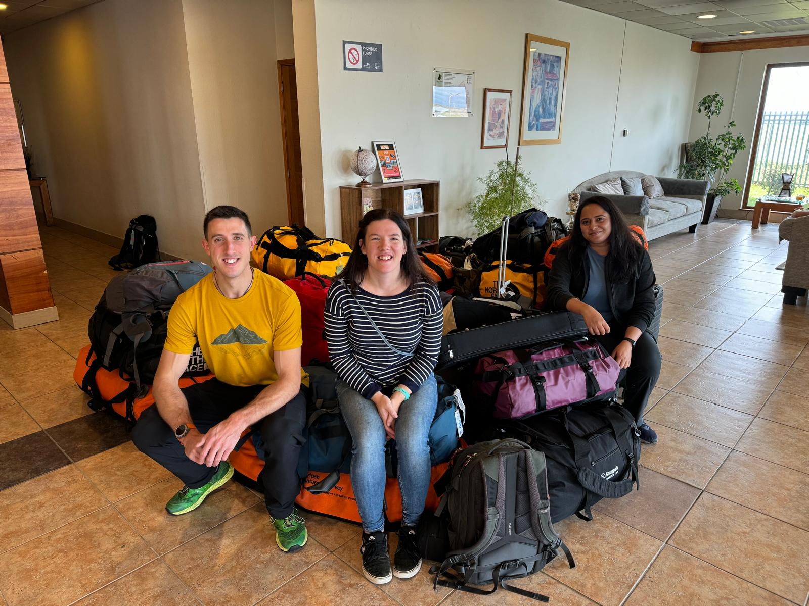

### September 9th 2024 - Full team science meeting
Today we are at the Scott Polar Research Institute in Cambridge, courtesy of a fellow Antarctic scientist, Rebecca Dell. This place is steeped in history and it is a privilege to work here and to follow in the footsteps of great Antarctic researchers that have gone before us. 

Each team member presented a different aspect of the project. Here's Andrew outlining his GNSS deployment strategy for all of us to discuss as a team.
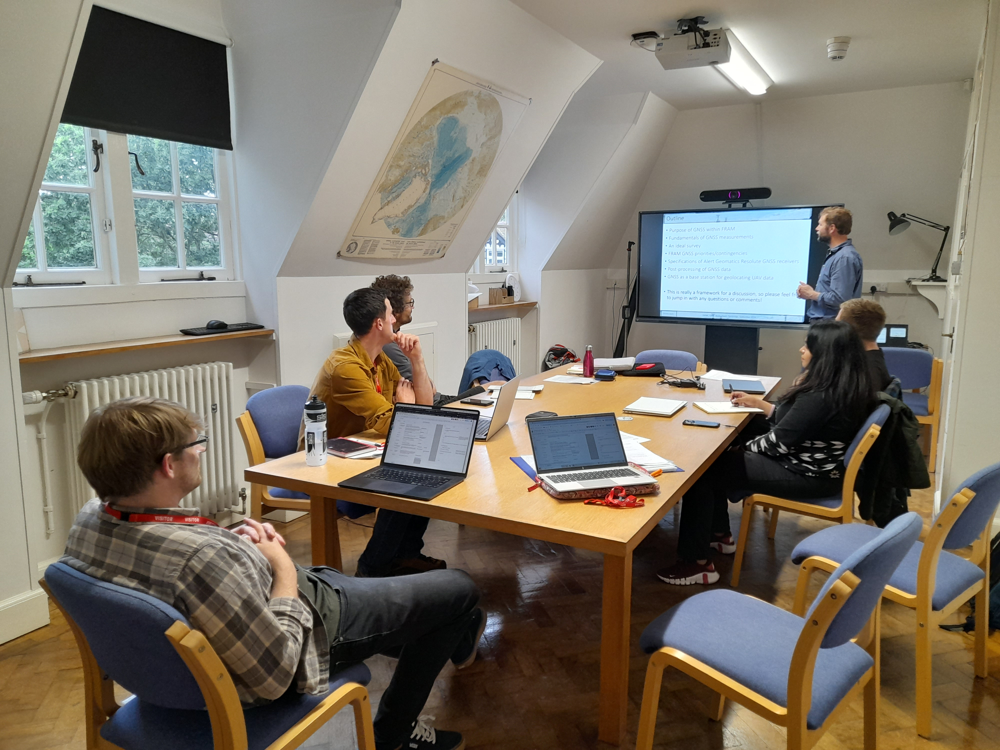

We spent the day coming up with detailed science plans, including lots of contingency plans for bad weather, or for cases where we can't get to our ideal site because of meltwater or crevasses. The meeting was fueled by Ben's epic mint chocolate tiffin. Thanks Ben!

The whole FRAM team

We also met with Keith Nicholls, at BAS who gave us some incredibly useful guidance on using the radar system ApRES: 
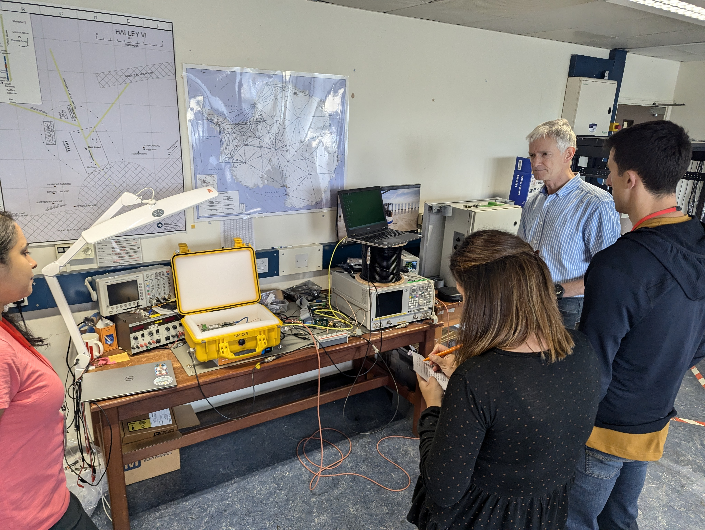

### September 5th 2024 - Pre-deployment training
We've arrived in Cambridge for our British Antarctic Survey (BAS) pre-deployment training. It's our first time meeting as a team in person! The field team (Kate, Ben and Rohi) have lots of training to complete including: Working in Antarctica, Biosecurity, Health and Safety, Living at Rothera Research Station, BAS safety Culture and conflict management. We also need to complete remote-fieldwork specific training like crevasse rescue and roped glacier traversing.

Here's a few photos from our training: 
The field team - Ben, Kate and Rohi
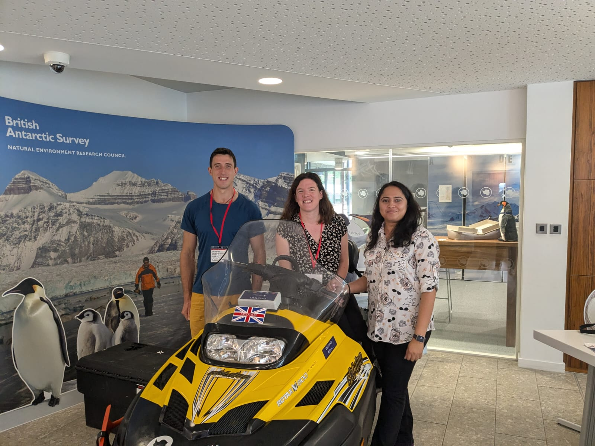

Lectures about life and work in Antarctica
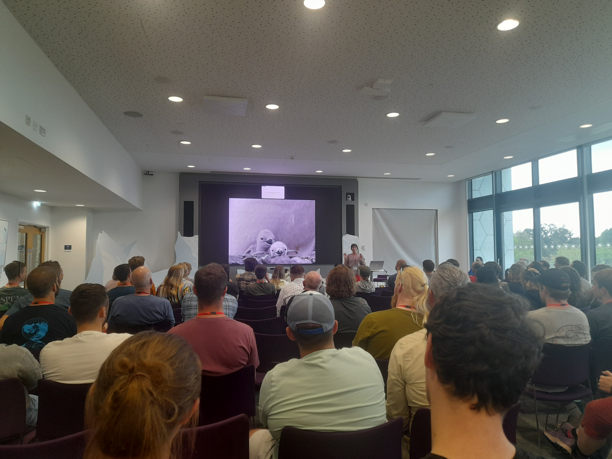

BAS provide all our polar clothing. We each have 18-20kg of clothing and accessories to carry south with us! This includes 3 pairs of gloves, 4 pairs of shoes, 2 sets of thermals, 2 hats, 2 jackets and the list goes on! We'll get even more when we reach Rothera! That's where they keep the big Mount Everest style down jackets and extreme polar hiking books. 

All Ben's clothing laid out on a table:
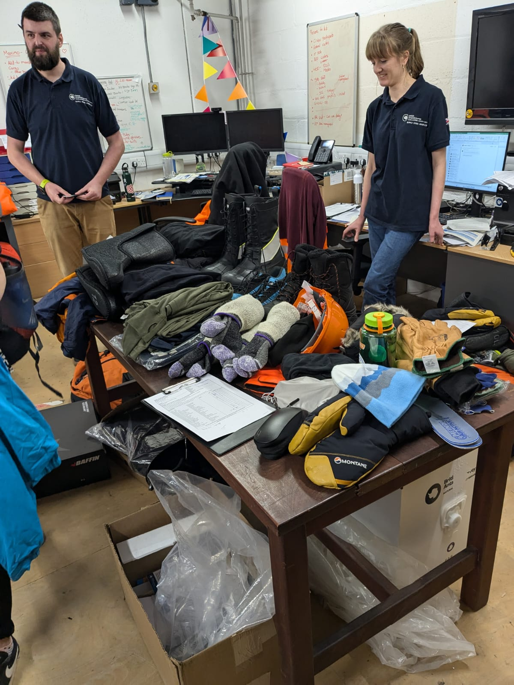

To rescue someone from a crevasse we need to learn how to stop them from falling any further (in the hope they can climb out themselves) but if they are injured then we need to set up a pulley system which will help us to pull them out of the crevasse safely.

One of our field guides, Sarah, showing us how to setup a 5:1 pulley system:

There's about 120 people at pre-deployment training and that's not even everyone going to Antarctica this year! Not everyone here will be going to Rothera, some people will be staying on the Sir David Attenborough ship and others will be going to other stations like Halley Research Station, or stations on Bird Island, Sidney, South Georgia. 

In this photo there's about 5-10 field scientists, almost everyone else is there to support the science. We couldn't conduct our research without them!
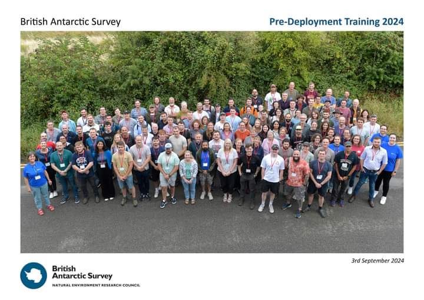

It's all getting quite real! We can't wait to go to Antarctica.

### Jun 13th 2024
Rohi is in Juneau, AK, testing out one of the Wingtra UAS. Everything is going well and she has sent back some incredible footage: 

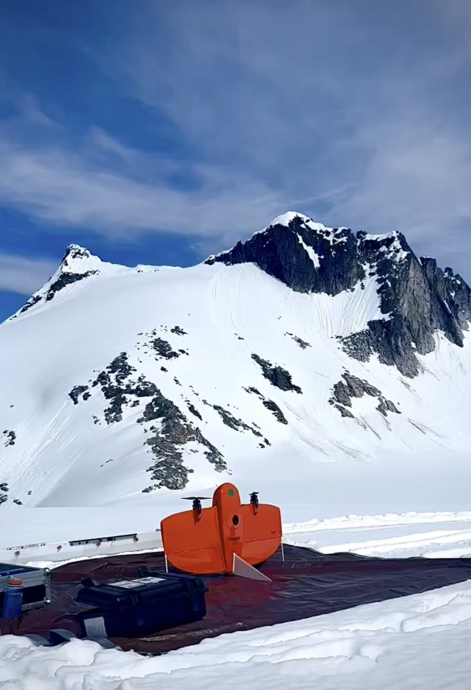

### Jun 11th 2024
Our first major shipment has successfully left Lamont! Nine individual items were palletized and shipped out this afternoon! This includes one of the Wingtra UAS, the ApRES units, a kovacs ice drill, laptops, tools. The shipment is due to arrive in Port Hueneme on Friday where it will continue its journey by ship to Punta Arenas, Chile.

### May-June 2024
#### Purchasing and packing!
Led my Rohi and Isabel, we have been frantically scoping equipment, getting quotes, signing up vendors to the Columbia system, purchasing equipment and eagerly unwrapping all science toys as they arrive. We've ordered all the components of the automatic weather station (including thermistor strings and an appropriately pre-programmed logger and customized logger enclosure), tools, zarge boxes, drills, pelican cases, laptops, SD cards, hard drives, stationary, chargers, batteries, and more. Thanks to Knut Christianson at The university of Washington, we also received four ApRES units back from Antarctica. Shipping delays meant that they arrived at LDEO roughly a week before they needed to be shipped south again, but we had time to test them and trouble shoot some issues. 

This photo does a pretty good job of showing the chaos that happens when your trying to unpack, test, and repack several different instruments in a small space

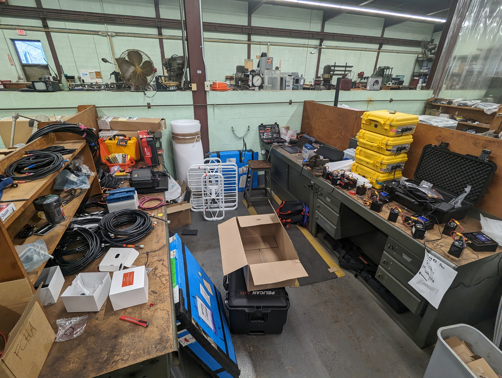

We also purchased a new weather proof case for the Wingtra UAV:

### May 2024
We are very excited to welcome Ben Davison to the project as a postdoctoral researcher based at the University of Sheffield. Ben did his PhD at Sheffield and did a PhD at Leeds before coming back to the Sheffield for this project. Ben will take part in the first Antarctic field season in Nov-Dec 2024. This completes the science side of field team: Rohi, Ben and Kate Winter. They will be joined by a BAS field assistant on Flask Glacier. 

### Apr 1st 2024
We are very excited to welcome Dr Rohi Muthyala to the project as a postdoctoral researcher based at LDEO. Rohi did her PhD at Rutgers and has many years experience working on and around the Greenland Ice Sheet. Rohi will take part in the first Antarctic field season in Nov-Dec 2024. We are so pleased to have her on board!

### Jan 24th 2024

The UAS arrived and Jonny went through unpacking everything and checking what's there. Looks like almost everything is present and correct! Next steps are to register it, assemble it, and start testing for (hopefully) a testing season in Alaska this summer. 

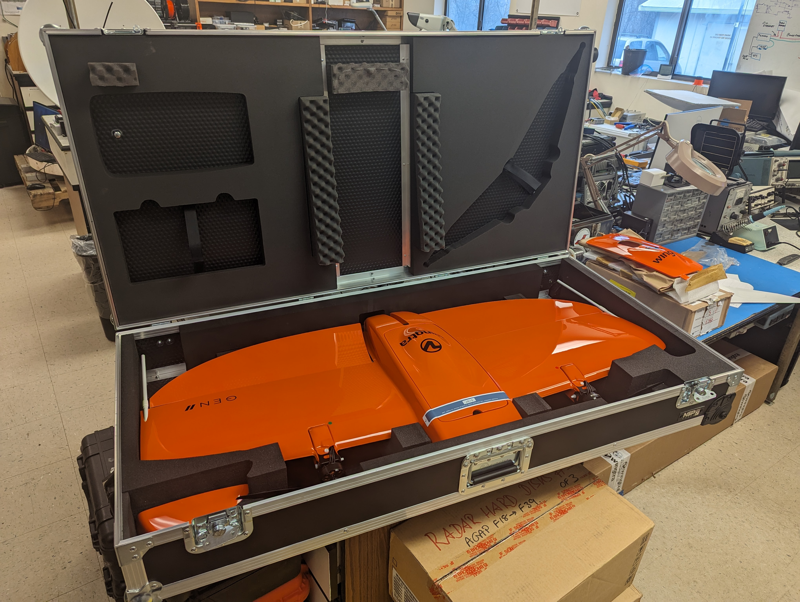

### Jan 23rd 2024
The UAS has arrived! Yesterday we received the WingtraOne uncrewed aerial system. More photos to follow.

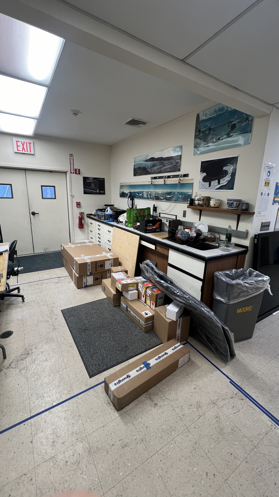

### Dec 15, 2023
We advertised a Sheffield-based postdoctoral research associate to work on the project. Details about the job and how to apply can be found [here](https://shorturl.at/lmuD3). Apologies for the incorrect closing date and typos at this link; the closing date is Monday 5th February and we anticipate interviewing for the post later in February.

### Sep 21, 2023
We had Tom from Wingtra at LDEO today demonstrating their UAS. 

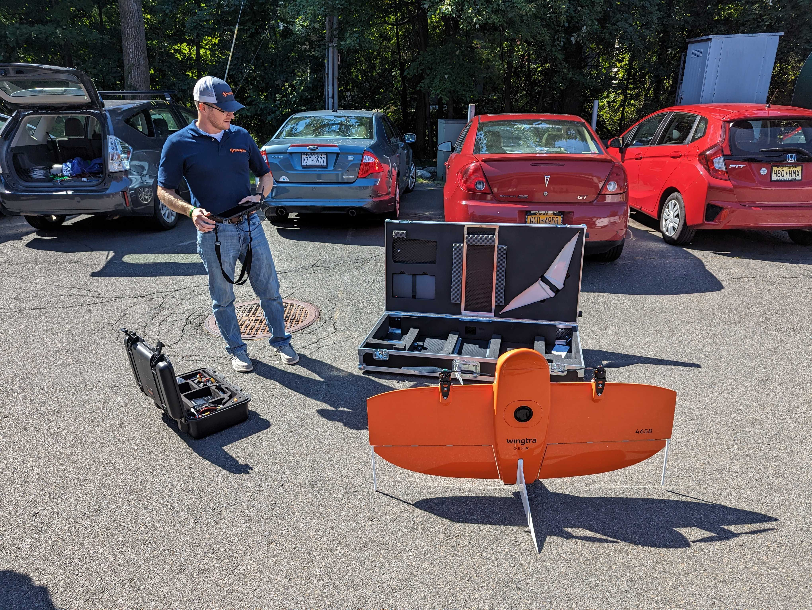
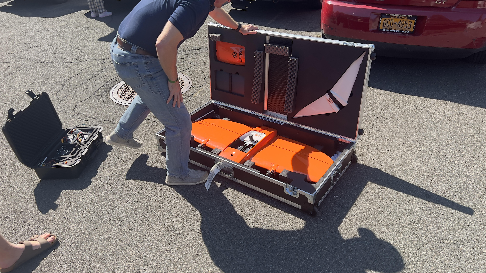
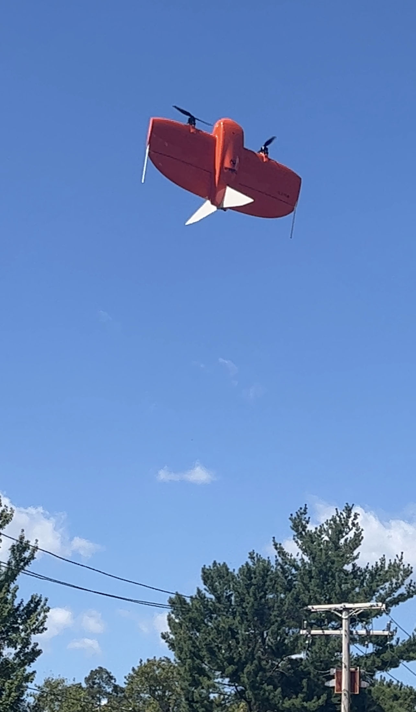

### Sep 19, 2023 
Excited to hear that we will be getting a demo from a company called Wingtra of their vertical take off, fixed-wing uncrewed aerial system (UAS) tomorrow on the Lamont campus. 

### Sep 06, 2023 
We advertised for an LDEO-based postdoctoral researcher to work on the project. The advert can be found [here](https://apply.interfolio.com/131480). 

### Aug 2023
The US side of the project kicks off! 

