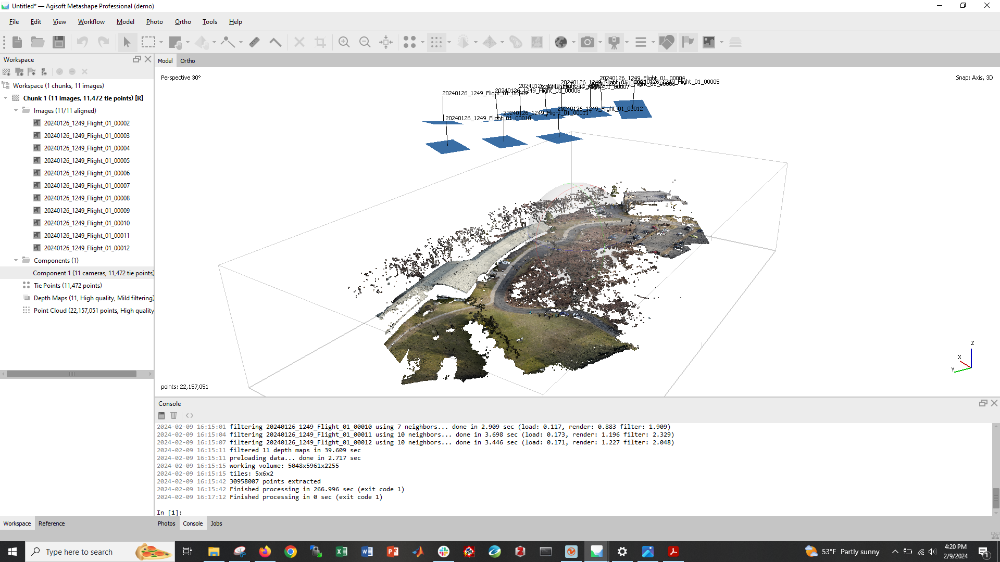

# Notes after first test flight of Wingtra 

Fri Feb 9th 2024

We conducted a short text flight of one of the Wingtras this afternoon (3pm ET). I also spent a couple of hours looking through the Wingtra [documentation](https://knowledge.wingtra.com/en/1-getting-started-with-wingtraone). 

The workflow is as follows:
1. Make sure all batteries are fully charged
2. Plan the survey using the WingtraPilot software either on a laptop (the software only runs on windows) or on the tablet
    - we planned a simple survey, with a very cautiously high survey altitude of >100m. 
3. Assemble the UAS
4. Power on the UAS and connect the antenna to the tablet
5. Go through the pre-flight check list. 
     - you need to include an area of corridor component to the survey, you cannot just have a take, then transition, then landing
     - it seemed to take some time to connect to the camera - i powered it off and on again to try and make it connect, but I think it was probably just taking some time.  
6. Press go and the UAS takes off and performs the survey and then lands
    - it landed within 3-4 m of its take off point, but not exactly on it.
7. Wait for the tablet to say it is safe to so, then power off UAS and take out the camera SD card. 
8. Copy the WingtraPilotProject folder on the computer with WingtraPilot installed.
9. Run through the steps in WingtraPilot to geotag the images
    - this involves getting a base station RINEX - a step that I havent managed for today's flight yet. 
10. Put the images into software like Agisoft Metashape to generate a point cloud, DEM and orthomosaic.

This is the first attempt at creating a dense point cloud

Things to consider:
1. Ground control points in the field
2. survey planning - probably need to plan on a computer rather than the tablet
3. we should get custom elevation data for Flash into the tablets. 
4. Should we invest in a powerful laptop to do processing in the field?

